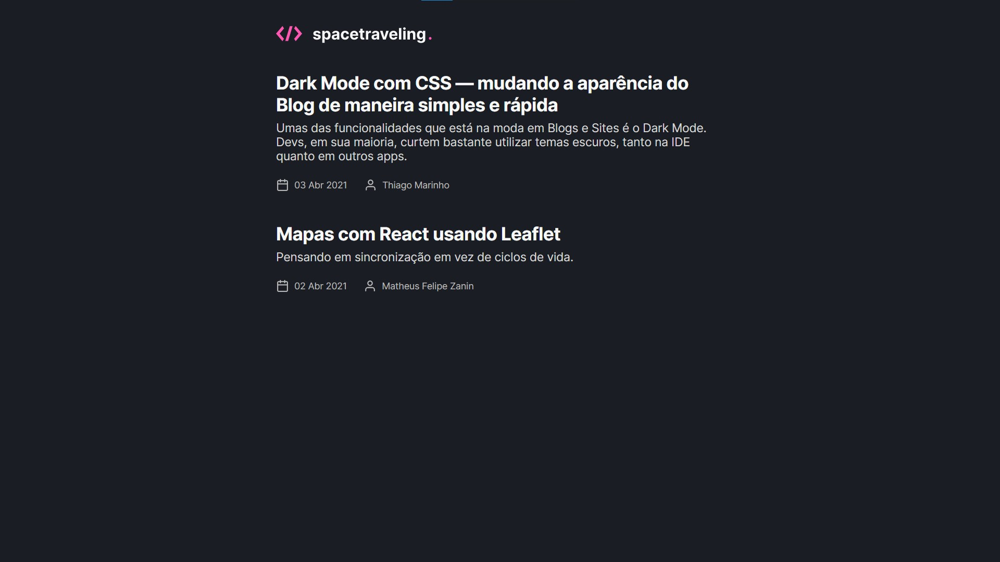
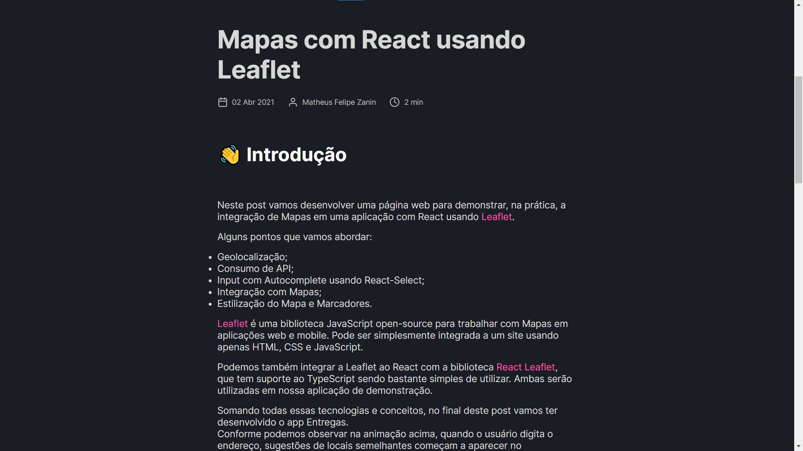

<div align="center">
  <h1>
    ⚔ Desafio — Ignite 🔥
    <br/><br/>
    Criando um projeto do zero
  </h1>

  > Repositório com o código de resolução do desafio **Criando um projeto do zero**, da trilha de React JS do bootcamp Ignite da Rocketseat.
</div>

<div align="center">
  

  > <small>spacetraveling, tela inicial</small>
</div>

<div align="center">
  

  > <small>spacetraveling, tela do post</small>
</div>

## 🎉 Começando

Clone o repositório:

```bash
git clone https://github.com/MattZ6/reactjs-spacetraveling-challenge
```

Adentre a pasta do projeto:

```bash
cd reactjs-spacetraveling-challenge
```

Instale as dependências:

```bash
yarn
```

## 🔥 Executando

Para "rodar" a aplicação em ambiente de desenvolvimento, execute:

```bash
yarn dev
```

## 🧪 Testando

Para "rodar" os testes, execute:

```bash
yarn test
```

___

<div align="center">
  <strong>Ignite Bootcamp 🔥</strong>
</div>
